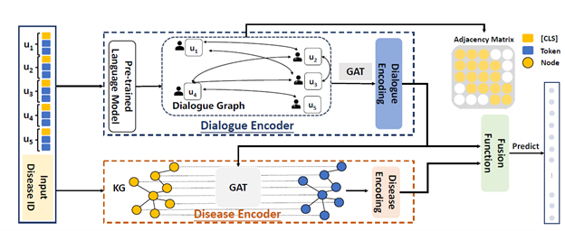

# DialMed


This repository is the code and data for ***DialMed: A Dataset for Dialogue-based Medication Recommendation, COLING 2022*** ([pdf](https://aclanthology.org/2022.coling-1.60/)).  




Figue 1: This is the framework of DDN(**D**ialogue structure and **D**isease knowledge aware **N**etwork) which is a model aiming to dialogue based medication recommendation.


**Requirements**

```
pytorch
numpy
sklearn
transformers
tqdm
```


**Usage**

Download the kg info and kg embedding (pretrained with [TransR](https://github.com/thunlp/OpenKE))

For the train, eval, test of DDN , 

```python
python train.py --data_path DialMed/data/ --cuda 0
```


**File Tree**

```
DialMed
├── LICENSE
├── README.md
├── src
│   ├── data.py
│   ├── model.py
│   ├── train.py
│   └── utils.py
├── data
│   ├── dataset
│   │   ├── label.json
│   │   ├── train.txt
│   │   ├── test.txt
│   │   └── dev.txt
│   ├── log
│   └── kg
│       ├── kg_info.pkl
│       └── transr_embedding_500.pkl
└── appendix
    ├── ddi.json
    ├── medication_normalization.json
    └── statistic_medication_ratio.py
```
